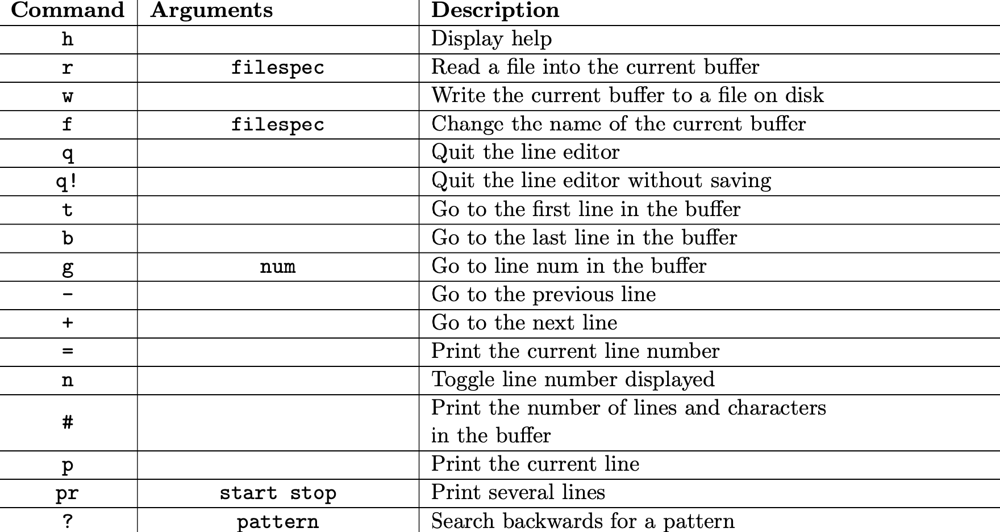
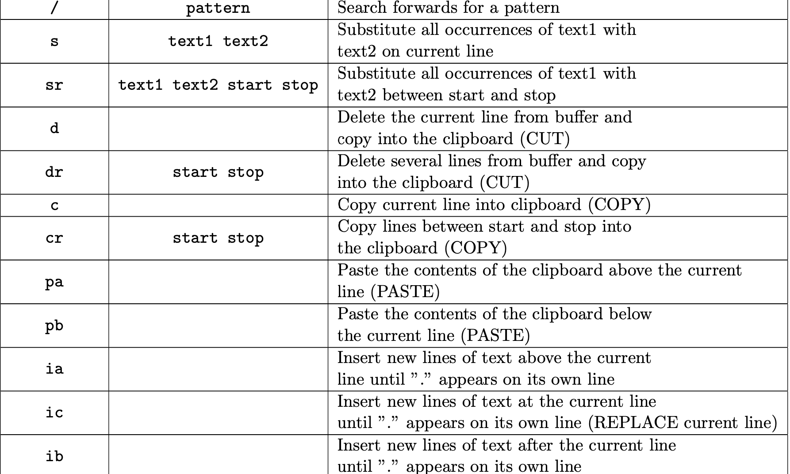

## Description

The command syntax is described below. An internal copy of a file is maintained as a list of text lines (strings). In
order to move freely up and down the file, the internal data structure is a doubly linked-list of lines (Java Strings).

## Editor Commands

